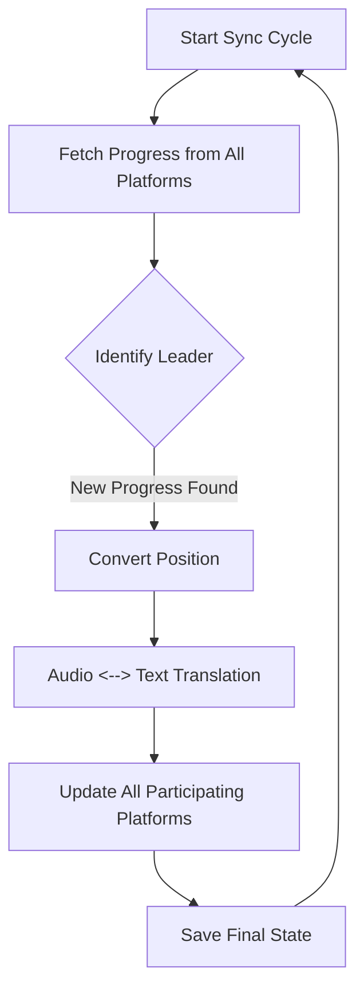

# ABS-KoSync Enhanced

<div align="center">


**The ultimate bridge for cross-platform reading and listening synchronization.**

[Features](#-features) • [How It Works](#-how-it-works) • [Quick Start](#-quick-start) • [Configuration](#-configuration) • [Web UI](#-web-interface) • [Troubleshooting](#-troubleshooting)

</div>

---

## 📖 What is it?

**ABS-KoSync Enhanced** is a powerful, automated synchronization engine designed to unify your reading and listening experiences. It bridges the gap between audiobooks and ebooks, ensuring that whether you're listening on the go or reading on your e-reader, your progress is always perfectly aligned.

### 🔄 Five-Way Synchronization

The system keeps your progress in sync across all major platforms:

| Platform | Type | Capability |
| :--- | :--- | :--- |
| **Audiobookshelf** | Audiobooks | Full Read/Write Sync |
| **KOReader / KOSync** | Ebooks | Full Read/Write Sync |
| **Storyteller** | Enhanced Reader | Full Read/Write Sync (REST API & SQLite) |
| **Booklore** | Library Management | Full Read/Write Sync |
| **Hardcover.app** | Book Tracking | Write-Only Tracking (Auto-Update Finished Status) |

---

## ✨ Features

### 🚀 Core Sync Engine
- **AI-Powered Alignment**: Uses Whisper AI transcription to accurately map audio timestamps to ebook text.
- **Multi-Platform Support**: Synchronize progress across five different ecosystems simultaneously.
- **Smart Conflict Resolution**: "Furthest progress wins" logic with built-in anti-regression protection.
- **Rich Positioning**: Support for XPath, CSS selectors, and EPUB CFI for pixel-perfect positioning.
- **Resumable Jobs**: Background transcription jobs resume automatically if interrupted.

### 🖥️ Management Web UI
- **Real-Time Dashboard**: Monitor progress and sync status across all your books.
- **Advanced Matcher**: Manual mapping for complex titles or different editions.
- **Batch Processing**: Queue and process multiple books for synchronization in bulk.
- **Book Linker**: Automated workflow for Storyteller readaloud generation.
- **Dynamic Settings**: Configure your entire system from the Web UI with instant hot-reloading.

### 🤖 Automation & Reliability
- **Background Daemon**: Configurable sync intervals for hands-off operation.
- **Auto-Organization**: Automatic addition to ABS collections and Booklore shelves.
- **Error Recovery**: Automatic retry logic for failed transcription or sync tasks.

---

## 🛠️ How It Works

The sync cycle ensures a seamless transition between platforms:



> [!NOTE]
> **Audio to Text Conversion**: The system extracts a snippet of text from the audiobook transcript at the current timestamp and performs a fuzzy search within the EPUB to find the corresponding ebook location.

---

## 🚦 Quick Start

### 1. Prepare Environment
```bash
mkdir abs-kosync && cd abs-kosync
mkdir data
```

### 2. Configure Docker Compose
Create a `docker-compose.yml` file.

```yaml
services:
  abs-kosync:
    image: ghcr.io/cporcellijr/abs-kosync-bridge:latest
    container_name: abs_kosync
    restart: unless-stopped
    ports:
      - "8080:5757"
    environment:
      - TZ=America/New_York
      - ABS_SERVER=https://your-abs-server.com
      - ABS_KEY=your_abs_api_token
      - ABS_LIBRARY_ID=your_library_uuid
    volumes:
      # === REQUIRED ===
      - ./data:/data                    # App data (database, transcripts)
      - /path/to/ebooks:/books          # Your EPUB library
      
      # === OPTIONAL: Helper Workflows ===
      # Map these if you plan to use the "Book Linker" automation:
      # - /path/to/ebooks:/linker_books              # Source ebooks to copy from
      # - /path/to/audiobooks:/audiobooks            # Source audiobooks to copy from
      # - /path/to/processing:/processing            # Temp folder for Storyteller processing
      # - /path/to/storyteller/library:/storyteller_ingest  # Final Storyteller library destination
      
      # === OPTIONAL: Legacy Support ===
      # - /path/to/storyteller/data:/storyteller_data # Only if using SQLite sync mode
```

### 3. Deploy
```bash
docker compose up -d
```

### 4. Configure via Web UI
Once the container is running, open `http://localhost:8080/settings`. You can configure all optional integrations (KOSync, Storyteller, Booklore, Hardcover) and sync behavior directly from the UI. **No container restart required!**

---

## ⚙️ Configuration

While you can use environment variables in your `docker-compose.yml`, we recommend using the **Web Settings Page** for easier management.

### 🔊 Audiobookshelf (Required)
| Variable | Description |
| :--- | :--- |
| `ABS_SERVER` | Your Audiobookshelf URL |
| `ABS_KEY` | API Token (Settings → Users) |
| `ABS_LIBRARY_ID` | The ID of the library to sync |

### 🔧 Integration Options (Configurable via UI)
- **KOSync**: Connect your KOReader sync server.
- **Storyteller**: Link your Storyteller library (API or local DB).
- **Booklore**: Integrate with Calibre-Web/Booklore management.
- **Hardcover**: Automatically update your "Finished" status on Hardcover.app.
- **Sync Tuning**: Adjust thresholds, Whisper models, and sync intervals.

---

## 🖥️ Web Interface

Access the UI at `http://your-ip:8080`.

- **Dashboard**: Overview of all active syncs and their current progress.
- **Settings**: Manage all configuration options with per-save hot-reloading.
- **Match Page**: Search for audiobooks and select their matching ebook file.
- **Batch Match**: Add multiple titles to a queue for automated processing.
- **Book Linker**: Automated Storyteller ingestion workflow.

---

## ❓ Troubleshooting

> [!TIP]
> **Check the Logs**: Documentation and live logs are available directly in the Web UI, or via `docker compose logs -f`.

- **Transcription taking too long?** Try setting `WHISPER_MODEL=tiny` in the Settings page, or enable **GPU acceleration** (see below).
- **Books not showing up?** Ensure your `/books` volume is correctly mounted and readable.
- **Syncing backwards?** The system includes anti-regression, but you can "Clear Progress" for a book in the Dashboard to reset its state.

### 🎮 GPU Acceleration (Optional)

For faster transcription, you can enable NVIDIA GPU acceleration:

1. Install [NVIDIA Container Toolkit](https://docs.nvidia.com/datacenter/cloud-native/container-toolkit/install-guide.html)
2. Add the GPU deploy section to your `docker-compose.yml`:
   ```yaml
   deploy:
     resources:
       reservations:
         devices:
           - driver: nvidia
             count: 1
             capabilities: [gpu]
   ```
3. In the Settings page, set:
   - **Whisper Device**: `cuda` (or `auto` to auto-detect)
   - **Whisper Compute Type**: `float16` (optimal for GPU)
   - **Whisper Model**: `small` or `medium` for better accuracy (GPU handles larger models faster)

---

## 🤝 Contributing & Support

Found a bug or have a suggestion?
1. Open an [Issue](https://github.com/cporcellijr/abs-kosync-bridge/issues)
2. Submit a [Pull Request](https://github.com/cporcellijr/abs-kosync-bridge/pulls)

### 📝 Contribution Guidelines
We follow a structured workflow to ensure stability:
- **`main`**: Stable release branch. Accepts merges **only** from `dev`.
- **`dev`**: Development branch. Target this branch for all Pull Requests.
- **Feature Branches**: Create your branch from `dev` (e.g., `feature/new-thing` or `fix/bug-name`).

> [!IMPORTANT]
> **PRs targeting `main` directly will be automatically blocked.** Please ensure your PR targets `dev`.

---

<p align="center">
  Generated by Antigravity AI
</p>
